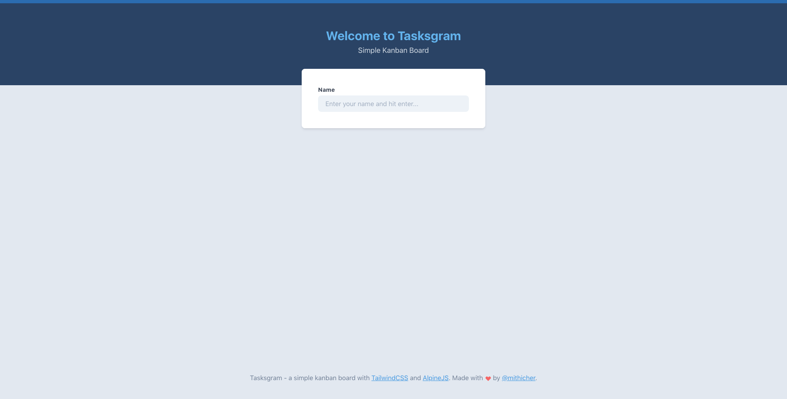
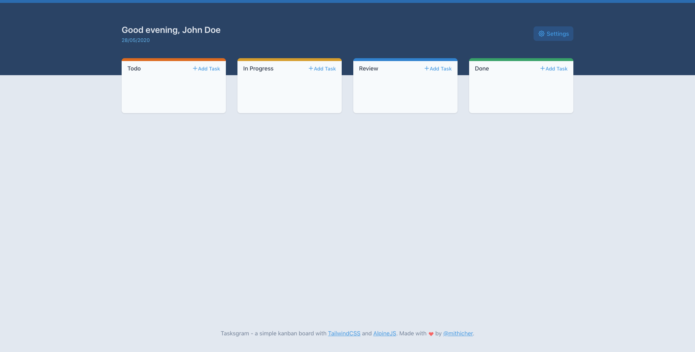
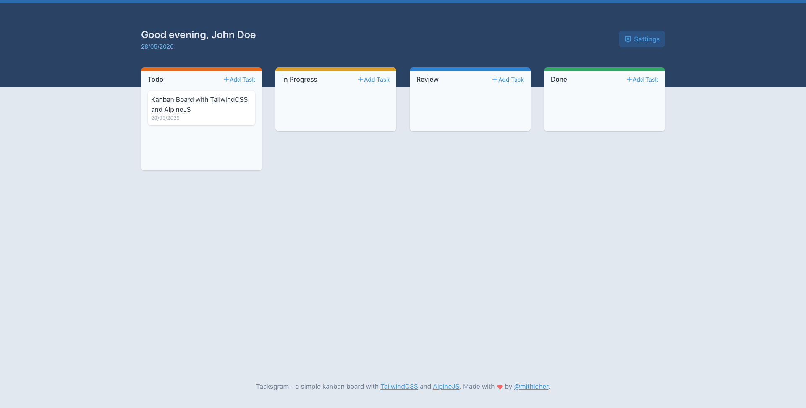
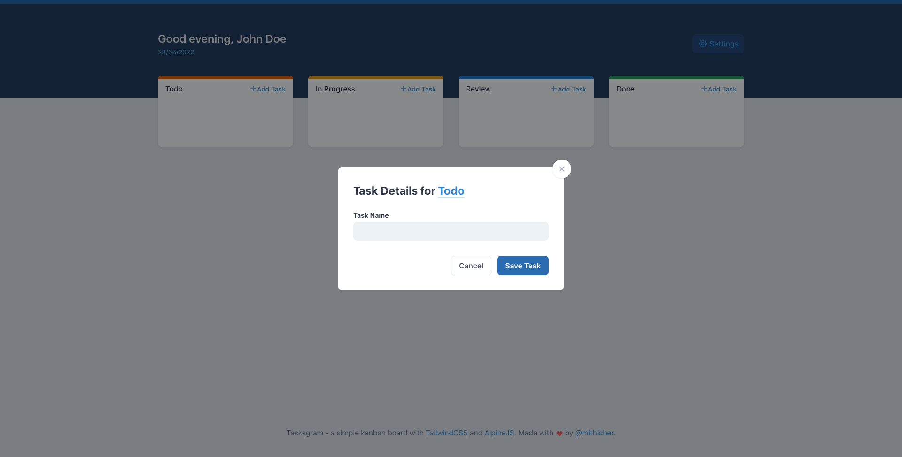
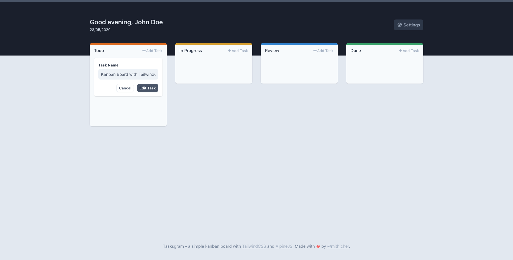
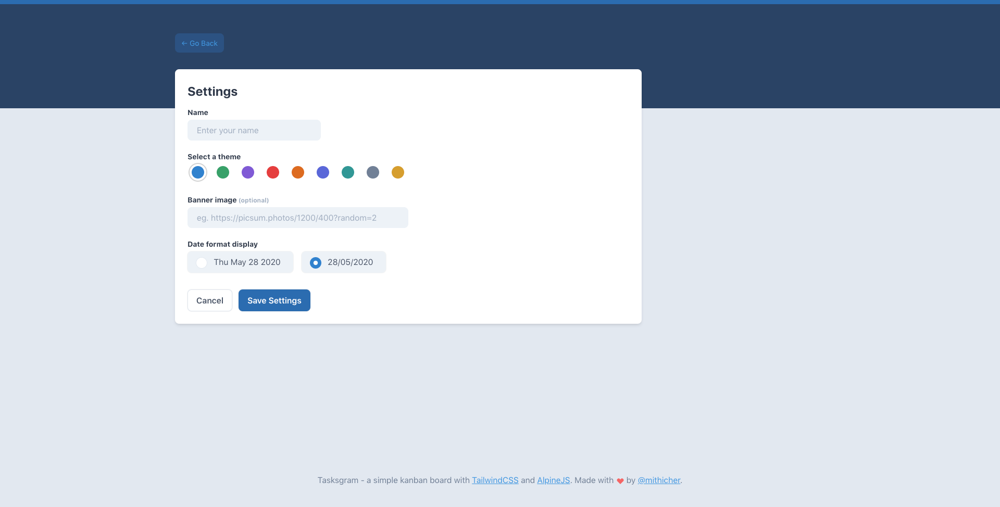
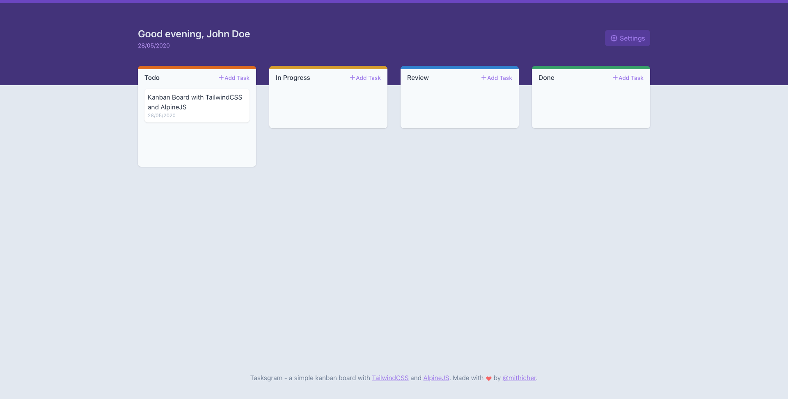
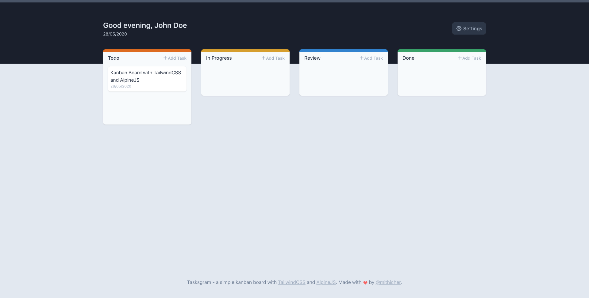

# Tasksgram
Simple Kanban Board

## Installation
```
git clone git@github.com:mithicher/tasksgram.git
```

## Implementation
- ALpine JS (Modals)
- Javascript Custom Event (Flash Message)
- C-Create R-Read U-Update with LocalStorage
- Styling with TailwindCSS
- Theming
- Javascript Date Formatting

## Features / Roadmap
- [X] Make Todos Cards
- [X] Save in LocalStorage
- [X] Cards are draggable
- [X] Settings Page
- [X] Theme Selection
- [X] Change Date Format
- [X] Double-click to edit todo card
- [ ] Sortable Cards
- [ ] Editable Boards
- [ ] Tasksgram Logo
- [ ] Desktop Apps

## For Laravel Valet User
Place the folder in your project folder eg. ./Sites/[Folder Name]

Then you can run the project via: 
```
[Folder Name].test
```

## Screenshots
Welcome Page 


Home Page 


Tasks/Todos


Create Task


Edit Task


Settings Page


Theme Indigo


Theme Black



